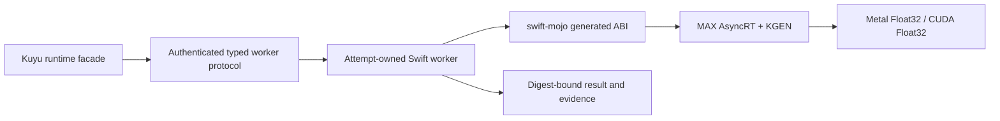

# Accelerator architecture

Status: implementation contract for the Metal and CUDA migration.

## Confirmed facts

The following observations were made with the isolated Modular stable
distribution `26.5.0`, MAX `26.5.0`, and Mojo `1.0.0 (ed45d567)` on
2026-08-21.

| Observation | Evidence | Design consequence |
|---|---|---|
| `max.gpu.host.DeviceContext` detects the Apple M4 Max | A real context probe reported `Accelerator: Apple M4 Max` | Metal is a real MAX device path, not a CPU alias |
| A Metal Float64 load is rejected by the compiler | The generated Metal program contained an unsupported `double` load | Canonical semantics remain Float64, while the Metal execution rung is Float32 |
| A Float32 Metal kernel reaches final `metallib` compilation | The only remaining local failure is the absent optional Xcode Metal Toolchain | Toolchain installation and real kernel execution are separate acceptance gates |
| A MAX-backed object references AsyncRT and KGEN | Object inspection reported `AsyncRT_DeviceContext_*` and `KGEN_CompilerRT_*` undefined symbols | Accelerator artifacts require an explicit dynamic runtime deployment contract |
| The MAX dependency closure can be reproduced exactly | swift-mojo schema-1 receipt `050ceac20bc593aed6e36757c050e01a0f0ec7d002bcebb49f3675d77ba4e179` re-inspected the object and four AsyncRT/KGEN libraries | Worker packaging consumes the verified receipt rather than ambient runtime search paths |
| Jetson Orin is the official `sm_87` target | Mojo's supported-target query reports `sm_87 - Ampere embedded (Jetson Orin)` | Jetson builds fix host `aarch64-unknown-linux-gnu`, CPU `cortex-a78ae`, and accelerator `sm_87` |
| Cross-compilation produces a real AArch64 ELF object | The Float32 CUDA probe emitted an 80 KiB ELF64 AArch64 relocatable object | Host architecture generation is proven, but native link and execution are not |
| Cross-compiled `DeviceContext` code embeds PTX targeted at `sm_80` | Assembly inspection found PTX 8.1 with `.target sm_80` despite the CLI `sm_87` target | The PTX is compatible with Orin JIT, but native `sm_87` specialization must be inspected on Jetson before qualification |

The device compatibility source is the official
[Mojo system requirements](https://mojolang.org/docs/requirements/). The MAX
host API is distributed by the official `modular` package; standalone Mojo does
not provide the required host runtime.

## Final execution boundary

The application does not load MAX into the UI or command adapter process. An
attempt-owned worker links the generated swift-mojo ABI and the declared MAX
runtime libraries, creates exactly one device context, and owns every device
buffer until shutdown.



The worker boundary isolates accelerator faults and dynamic runtime deployment
from the application while preserving the Kuyu worker lifecycle already
defined by `kuyu/SPEC.md`. A local macOS worker and a remote Jetson worker use
the same typed request/result contract. Transport, authentication, progress
journaling, cancellation, and accepted-artifact publication remain owned by
the Kuyu runtime rather than the compute backend.

## Numeric contract

```text
Canonical Float64 program and state
    -> CPU Float64 semantic verifier
    -> explicit finite Float32 materialization
        -> CPU Float32 precision verifier
        -> Metal Float32 executor
        -> CUDA Float32 executor
```

`MojoCanonicalValue` is the semantic boundary. Device-specific storage never
changes the canonical program digest. Every execution identity records numeric
type and device class. A conversion overflow, unsupported numeric type,
missing device, or unavailable runtime is a typed failure. No executor selects
CPU or another accelerator as a fallback.

## Runtime dependency contract

The current swift-mojo static artifact verifier correctly rejects KGEN and
other undeclared dynamic runtime symbols. Its separate schema-1 runtime receipt
now binds object/library digests, target architecture, exact symbol providers,
and the transitive Mach-O/ELF dependency closure. Accelerator support consumes
that receipt rather than weakening the static check. The worker bundle still
must declare:

| Field | Required meaning |
|---|---|
| Runtime distribution | Exact Modular/MAX version and package digest |
| Dynamic libraries | Exact filenames, digests, platform, and architecture |
| Loader policy | Worker-relative search roots with no ambient path fallback |
| Device target | Metal family or CUDA compute capability |
| Numeric capabilities | Supported storage and compute dtypes |
| Synchronization | Completion point for every host-visible transfer |
| Shutdown | Device buffers, context, runtime, and process termination order |

The receipt verifier is the first worker preflight stage and rejects a changed,
missing, ambiguous, unreachable, wrong-architecture, or path-disguised runtime
dependency. The future worker preflight additionally validates loader layout and
device capability before accepting an attempt. Runtime libraries are packaged
beside the worker; they are not discovered through an uncontrolled system
search path.

## Resource ownership

| Resource | Creator | Owner | Lifetime | Failure contract |
|---|---|---|---|---|
| Worker process | Kuyu attempt launcher | Attempt context | One attempt | Missing or contradictory terminal result is failure |
| MAX runtime | Worker startup | Worker process | Process lifetime | Digest or loader mismatch rejects startup |
| Device context | Accelerator session factory | Worker session | Attempt or bounded shard | Unsupported API/device is a typed failure |
| Compiled canonical plan | Kuyu Mojo compiler | Immutable worker snapshot | Program revision | Program digest and executor identity must match |
| Device buffers | Worker session | Worker session | Bounded operation/session | Destroyed before context shutdown |
| Host borrow | Swift call scope | Caller | Synchronous borrow | Pointer never escapes the generated ABI call |
| Result | Worker | Attempt artifact store | Durable attempt history | Published only after parity and artifact validation |

## Acceptance gates

| Gate | macOS Metal | Jetson CUDA |
|---|---|---|
| Receipt | Real object and four-library MAX closure verified | Native ELF object/shared-library receipt pending |
| Toolchain | Optional Xcode Metal Toolchain present | Native Modular/MAX and CUDA toolchain present |
| Build | Worker links declared MAX dylibs | Native AArch64 worker links declared MAX shared libraries |
| Device | Real Apple GPU context | Real Orin `sm_87` context |
| Numeric | Float32 kernel; Float64 request rejected | Float32 kernel; declared capability negotiation |
| Behavior | CPU Float32 differential, failure, synchronization, shutdown | Same plus native Jetson link/run and PTX/SASS target inspection |
| Performance | Batch throughput and transfer budget | Batch throughput, thermal stability, and sustained-power budget |
| Safety | Cancellation and worker crash tombstone | Same plus hardware-in-the-loop control boundary |

Cross-compilation, a device query, or successful process exit alone does not
complete an accelerator gate.
