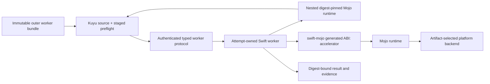

# Accelerator architecture

Status: implementation contract for backend-neutral Mojo acceleration.

Kuyu and Manas expose only `cpu` and `accelerator`. Metal, CUDA, architecture,
and accelerator-family names belong to the immutable artifact identity and its
deployment acceptance tooling. They are not runtime choices in physics,
learning, or session APIs.

## Confirmed facts

The following observations were made with the isolated Modular stable
distribution `26.5.0`, MAX `26.5.0`, and Mojo `1.0.0 (ed45d567)` on
2026-08-21.

| Observation | Evidence | Design consequence |
|---|---|---|
| `max.gpu.host.DeviceContext` detects the Apple M4 Max | A real context probe reported `Accelerator: Apple M4 Max` | Metal is a real MAX device path, not a CPU alias |
| A Metal Float64 load is rejected by the compiler | The generated Metal program contained an unsupported `double` load | Canonical semantics remain Float64, while the Metal execution rung is Float32 |
| A repo-owned Float32 Metal kernel compiles and executes on Apple M4 Max | The installed Metal Toolchain compiled `HardwareAcceptance/MetalVectorAddProbe.mojo` for `metal:4`; all 257 outputs passed after host/device transfer and explicit synchronization | This remains the lower-level kernel, transfer, and synchronization regression beneath canonical acceptance |
| The same canonical plans execute on Metal | A Swift fixture generator compiled reference digest `6c6773c5…` for CPU and Metal identities, required exactly equal encoded plan values and bindings, and generated a two-scenario differential harness for all nine force graphs, derivative, and observables | Metal does not define or duplicate Kuyu equations; CPU Float32 remains the oracle for the accelerator precision rung |
| A MAX-backed object references AsyncRT and KGEN | Object inspection reported `AsyncRT_DeviceContext_*` and `KGEN_CompilerRT_*` undefined symbols | Accelerator artifacts require an explicit dynamic runtime deployment contract |
| The MAX dependency closure can be reproduced exactly | swift-mojo schema-1 receipt `050ceac20bc593aed6e36757c050e01a0f0ec7d002bcebb49f3675d77ba4e179` re-inspected the object and four AsyncRT/KGEN libraries | Worker packaging consumes the verified receipt rather than ambient runtime search paths |
| The receipt can be linked and relocated without ambient runtime search | swift-mojo bundle `38075467012f877bb5ea23daf3d4639aa175b478bfaca898706bd33e1ff72e77` passed fresh tree, digest, Mach-O import, and `@executable_path/../lib` verification before minimal-environment execution created an Apple M4 Max context | macOS deployment identity is proven; Kuyu protocol, compute, cancellation, and native Jetson remain separate gates |
| A Metal kernel bundle is reproducible and relocatable | The repo-owned acceptance source twice produced receipt `2bc7264e13acb31f1c0be774cac0b07d5e450d44d552dbfb669dead321b98f50` and bundle `643f18ba4b227ba253e64642fdbfa9de0508d0a85d691d099d0bf846d9bdbf97`; original and relocated `env -i` execution both passed kernel, transfer, synchronization, and 257-value correctness checks | Runtime packaging now covers real Metal execution, but not canonical dynamics, policy training, worker lifecycle, or performance qualification |
| The canonical Apple accelerator bundle is reproducible and relocatable | The backend-neutral generator produced receipt `c0b15f5d1628d1eec444d513de876028c7e940ddae15af209bc08d577e2cbb6c` and bundle `4337e0ba9aff535f07db67908b929aff403c6f11022738e8d5f3d78c1e072636` twice; original and relocated `env -i` executions each passed 11 graphs × 2 scenarios and reported only `accelerator` to Kuyu | Canonical graph execution, transfer, synchronization, runtime closure, and relocation are proven on Apple M4 Max; the concrete `metal:4` target remains artifact metadata, while production worker lifecycle and training remain separate gates |
| A generated callable Metal library has a persistent session ABI | swift-mojo schema-3 bundle `2e89bda4bc15fb935f5df9cb1a43f029336653ef095bea62d60076dbb3d84f99` and receipt `3969ad6b6d12dd2416aa745bdc4037ad2faba85bd24b34d0abd3d5eb1c8be747` bind the module, input graph, generated header, runtime closure, factory, and borrowed-buffer execution function; a minimal-environment C probe and the Swift loader both reused one Apple M4 Metal session | Production admission and invocation no longer depend on the schema-1 acceptance executable; session/device-buffer lifetime is explicit and reusable |
| Kuyu can independently admit the callable runtime through a public read-only API | `MojoAcceleratorRuntimeBundlePreflighting` re-verifies the schema-3 bundle and matches schema, bundle/receipt/graph identities, target, module, and every typed factory/execution relationship before returning the verified dylib and ordered bindings | An outer attempt worker bundle can re-verify the nested runtime on source and staged snapshots without importing swift-mojo internals into the generic launcher |
| Jetson Orin is the official `sm_87` target | Mojo's supported-target query reports `sm_87 - Ampere embedded (Jetson Orin)` | Jetson builds fix host `aarch64-unknown-linux-gnu`, CPU `cortex-a78ae`, and accelerator `sm_87` |
| Cross-compilation produces a real canonical AArch64 ELF object | The backend-neutral accelerator fixture emitted a 201,528-byte ELF64 AArch64 relocatable object with SHA-256 `d1751032ed6b08cfd318f1145c2eb36429b43ad72a747897b9d515d84c357253` | Canonical host architecture generation and Jetson artifact identity are proven, but native link and execution are not |
| The Jetson handoff is reproducible, source-complete, and toolchain-bound | Two independent runs of `scripts/prepare-cuda-canonical-acceptance.sh` produced identical source `5e482da9…`, object `d1751032…`, imported module closure `bec3fe7e…`, and evidence `2e1301af…`; the object is compiled against the copied closure, and the evidence binds Mojo `1.0.0 (ed45d567)` plus pixi manifest `b66568f6…` and lock `3f61eabd…` | Jetson admission can reject changed source, object, module closure, canonical program, target, or toolchain before attempting native link/run |
| Cross-compiled `DeviceContext` code embeds PTX targeted at `sm_80` | Canonical object inspection found PTX 8.1 with `.target sm_80` despite the CLI `sm_87` target | The PTX is compatible with Orin JIT, but native `sm_87` specialization must be inspected on Jetson before qualification |
| Modular MAX 26.5.0 provides a pinned Linux ARM64 NVIDIA image | Registry inspection resolved index `cb38ee4e…` to Linux ARM64 manifest `4566cb6f…`, whose OCI configuration declares ARM64, CUDA 13.0, and Modular revision `ed45d567` | Native acceptance uses this exact manifest rather than a mutable tag or an ambient Jetson toolchain |
| Wendy admission is fail-closed before deployment | The host runner requires exact WendyOS `0.18.1`, AArch64, NVIDIA, and Jetson Orin device fields before invoking `wendy run`; GPU is its only entitlement | An offline, wrong-OS, wrong-architecture, wrong-vendor, or wrong-device response produces no deployment and cannot become native success |

The device compatibility source is the official
[Mojo system requirements](https://mojolang.org/docs/requirements/). The MAX
host API is distributed by the official `modular` package; standalone Mojo does
not provide the required host runtime.

## Final execution boundary

The application does not load MAX into the UI or command adapter process. Kuyu
first validates the outer source bundle and its nested runtime, the training
runtime stages one immutable attempt-owned copy, and Kuyu validates both again
immediately before launch. The executable path selects the Kuyu worker, never
the nested accelerator library. The attempt-owned worker dynamically opens only
the verified generated swift-mojo ABI and its declared MAX runtime libraries,
creates exactly one device context per session, and owns every device buffer
until shutdown.



The worker boundary isolates accelerator faults and dynamic runtime deployment
from the application while preserving the Kuyu worker lifecycle already
defined by `kuyu/SPEC.md`. A local macOS worker and a remote Jetson worker use
the same typed request/result contract. Transport, authentication, progress
journaling, cancellation, and accepted-artifact publication remain owned by
the Kuyu runtime rather than the compute backend.

## Numeric contract

```text
Canonical Float64 program and state
    -> CPU Float64 semantic verifier
    -> explicit finite Float32 materialization
        -> CPU Float32 precision verifier
        -> backend-neutral accelerator executor
            -> artifact-selected platform backend
```

`MojoCanonicalValue` is the semantic boundary. Device-specific storage never
changes the canonical program digest. Every execution identity records numeric
type and device class. A conversion overflow, unsupported numeric type,
missing device, or unavailable runtime is a typed failure. No executor selects
CPU or another accelerator as a fallback.

## Runtime dependency contract

The earlier schema-1 acceptance executable remains reproducible evidence for
canonical graph parity and relocation, but it is no longer the production
admission boundary. The current swift-mojo schema-3 library verifier binds the
shared library and runtime-closure digests, target architecture, module and
input-graph identities, generated C header, exact exported symbols, typed
bindings, system boundary, and relative loader root. Kuyu consumes that verified
identity without weakening static-artifact checks. The Kuyu worker protocol must
additionally declare:

| Field | Required meaning |
|---|---|
| Runtime distribution | Exact Modular/MAX version and package digest |
| Dynamic libraries | Exact filenames, digests, platform, and architecture |
| Loader policy | Worker-relative search roots with no ambient path fallback |
| Artifact target | Platform triple, CPU, and compiler accelerator target; never exposed as a Kuyu or Manas device choice |
| Numeric capabilities | Supported storage and compute dtypes |
| Synchronization | Completion point for every host-visible transfer |
| Shutdown | Device buffers, context, runtime, and process termination order |

The receipt verifier rejects a changed, missing, ambiguous, unreachable,
wrong-architecture, or path-disguised runtime dependency. Bundle verification
then rejects changed files, extra entries, missing runtime imports, and ambient
loader roots before Kuyu accepts an attempt. Kuyu additionally requires exact
schema, bundle, receipt, target, module, and input-graph matches, one typed
factory and a nonempty ordered set of uniquely named execution bindings owned
by that factory, and a safe library-relative path even when a verifier
implementation is injected. Duplicate binding IDs, missing generated ABI
entries, and unknown execution names are typed failures; they do not select
another operation. Runtime libraries are packaged beside the worker; they are
not discovered through an uncontrolled system search path.

## Resource ownership

| Resource | Creator | Owner | Lifetime | Failure contract |
|---|---|---|---|---|
| Worker process | Kuyu attempt launcher | Attempt context | One attempt | Missing or contradictory terminal result is failure |
| MAX runtime | Worker startup | Worker process | Process lifetime | Digest or loader mismatch rejects startup |
| Device context | Mojo accelerator session factory | Worker session | Attempt or bounded shard | Unavailable accelerator is a typed failure; no vendor fallback occurs in Kuyu or Manas |
| Compiled canonical plan | Kuyu Mojo compiler | Immutable worker snapshot | Program revision | Program digest and executor identity must match |
| Device buffers | Worker session | Worker session | Bounded operation/session | Destroyed before context shutdown |
| Host borrow | Swift call scope | Caller | Synchronous borrow | Pointer never escapes the generated ABI call |
| Adam runtime transport | Kuyu verified-runtime adapter | One Manas optimizer session | Session lifetime | Exact ordered Manas ABI; session closes before dynamic runtime |
| Core inference transport | Kuyu verified-runtime adapter | One Manas Core model session | Session lifetime | Exact Core factory plus initialize/infer ABI; Manas owns payload and recurrent state |
| Reflex inference transport | Kuyu verified-runtime adapter | One Manas Reflex model session | Session lifetime | Exact Reflex factory plus initialize/infer ABI; independent from Core cadence and state |
| Result | Worker | Attempt artifact store | Durable attempt history | Published only after parity and artifact validation |

## Acceptance gates

| Gate | macOS Metal | Jetson CUDA |
|---|---|---|
| Receipt | Canonical Apple-target object and four-library MAX closure verified as receipt `c0b15f5d…` | Source-complete backend-neutral cross-compile handoff `2e1301af…` available; native ELF object/shared-library receipt pending |
| Toolchain | Metal Toolchain `v27.1.5237.12` present and used | Cross-compiler locked by pixi manifest `404c7d32…` and lock `3f61eabd…`; native container fixed to MAX image manifest `4566cb6f…` |
| Build | Exact callable `metal:4` bundle `2e89bda4…` links all declared MAX dylibs; backend-neutral canonical evidence bundle `4337e0ba…` reports only `accelerator` to Kuyu | Linux ARM64 acceptance image `01ff0807…` built from the pinned manifest; native shared-library link still requires the admitted Jetson device path |
| Device | Real Apple GPU context and kernel execution in original and relocated workers | Real Orin `sm_87` context |
| Numeric | CPU/Metal Float32 differential passed all outputs for 11 graphs × 2 scenarios; Float64 Metal is rejected as a typed compile failure | Float32 kernel; declared capability negotiation |
| Behavior | Canonical transfer, kernel execution, synchronization, original execution, and relocated execution passed; malformed-device-input tests and production shutdown remain | Same plus native Jetson link/run and PTX/SASS target inspection |
| Performance | Batch throughput and transfer budget | Batch throughput, thermal stability, and sustained-power budget |
| Safety | Cancellation and worker crash tombstone | Same plus hardware-in-the-loop control boundary |

Cross-compilation, a device query, or successful process exit alone does not
complete an accelerator gate.
