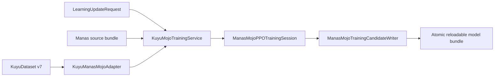

# kuyu-mojo

Mojo compute implementations and Kuyu-to-Manas composition. KuyuPhysics owns
canonical dynamics, KuyuTraining owns persisted learning evidence, and Manas
owns model and optimizer semantics. This package binds those contracts without
creating a second authority for any of them.

## Active Products

| Product | Responsibility |
|---|---|
| `KuyuMojoCore` | Verified Mojo artifact and accelerator-runtime admission |
| `KuyuMojoDynamics` | Compile and execute canonical Kuyu dynamics programs |
| `KuyuManasMojoAdapter` | Convert verified KuyuDataset v7 records to Manas learning contracts |
| `KuyuMojoTrainingRuntime` | Execute one bounded dataset-to-candidate learning update |

`KuyuMojoTrainingRuntime` also retains target-qualified worker artifact
preflight as optional accelerator plumbing. The bounded application path calls
the in-process training service directly; worker admission is not a hidden
fallback and does not select another numerical backend.

## Learning Path



The service:

1. validates source and dataset identities and binds behavior evidence to the
   exact SHA-256-pinned source checkpoint;
2. verifies exact behavior-distribution and recurrent-trajectory evidence;
3. enforces transition and complete-scalar budgets;
4. executes Core forward, GAE, clipped PPO, recurrent BPTT, gradient clipping,
   and Adam in a Mojo-owned session;
5. snapshots the complete model and optimizer state; and
6. publishes atomically, then reloads the result through the production Manas
   loader before returning success.

When the source is a prior candidate, the service restores all parameters,
both Adam moment vectors, the update count, and the Lagrange multiplier. A base
bundle without a training checkpoint takes the explicit fresh-initialization
path; there is no silent partial resume.

The default bounded profile accepts at most 256 transitions and 8,000,000
materialized scalars. A trajectory larger than the configured exact recurrent
minibatch is rejected; it is not silently truncated or split across invalid
sequence boundaries.

Cancellation before publication leaves no candidate. Publication is the atomic
commit point. Existing destination directories are never overwritten.

## Performance Direction

The current controller has 69,323 trainable parameters. On the designated M4
Max, the 32-transition production update measures about 2.9 ms after
initialization and is protected by a 10 ms budget. CPU SIMD is intentional for
this shape because it avoids accelerator launch, synchronization, and transfer
overhead. It is implemented in Mojo, not Swift tensor code.

Mojo does not erase Apple/NVIDIA hardware differences. `swift-mojo` verifies
target-qualified artifacts by triple, architecture, runtime closure, and digest.
An accelerator-resident PPO session is admitted only if a larger measured
workload fails the CPU budget.

## Platform Roles

- The Apple Silicon Mac is the training, evaluation, tuning, and candidate
  publication host.
- Jetson AGX Orin consumes accepted artifacts for inference, real-time control,
  and HIL verification.
- Cross-generation is not Jetson execution evidence. Native Jetson load,
  inference parity, latency, memory/power, cancellation, shutdown, and safety
  gates remain mandatory before robot deployment.

## Verification

Use the Xcode path so generated Mojo frameworks and the actual application
loader are exercised:

```bash
xcodebuild build-for-testing \
  -scheme kuyu-mojo-Package \
  -destination 'platform=macOS' \
  -skipPackagePluginValidation

xcodebuild test \
  -scheme kuyu-mojo-Package \
  -destination 'platform=macOS' \
  -maximum-test-execution-time-allowance 60 \
  -skipPackagePluginValidation
```

Detailed numerical evidence is recorded in `RELIABILITY_EVIDENCE.md` and the
canonical dynamics tolerances are defined in `PARITY_CONTRACT.md`.
